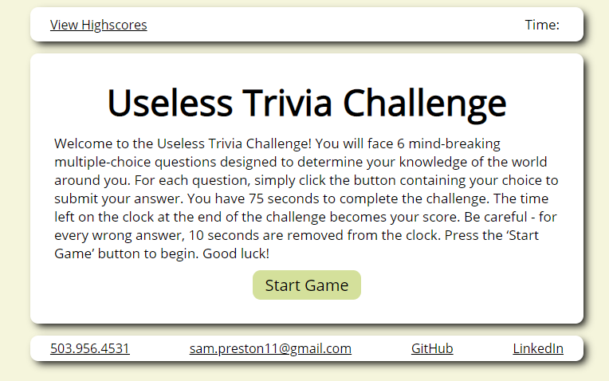
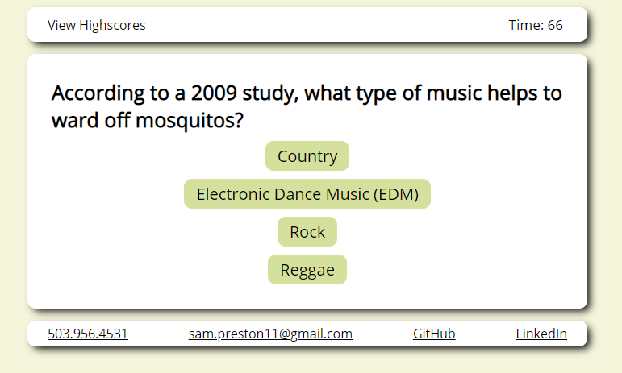
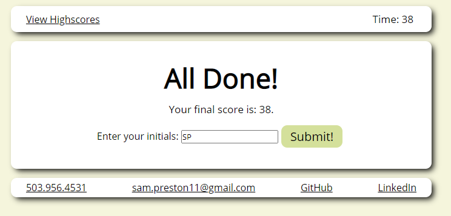
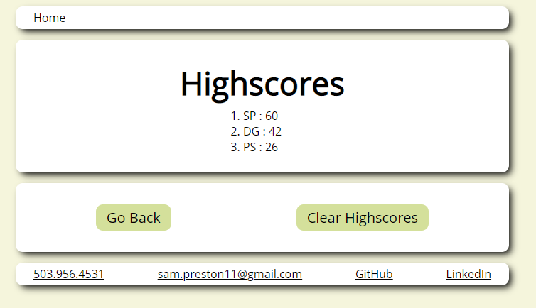

# Useless Trivia Challenge

## Description
This application is a timed trivia challenge featuring 6 multiple-choice questions. Users will start the game and take the challenge. After answering all question, or the time runs out, the game will end. After the game ends the user is prompted to save their highscore. Users can navigate to, and reset, the highscore page at any point. This application will run in the browser and features dynamically updated HTML and CSS powered by JavaScript. It has a clean, polished, and responsive user interface that adapts to multiple screen sizes.  

[Deployed Application](https://spreston4.github.io/trivia-challenge/)

[GitHub Repo](https://github.com/spreston4/trivia-challenge)

## Technologies used
Built in Visual Studio with:
* HTML
* CSS
* JavaScript
* Web APIs

## How to
When the application is loaded, the user is presented with the following screen. Press the 'Start Game' button to begin!


When the game starts, the timer in the upper left corner will start, initializing at 75 seconds. The user will then be presented with 6 multiple choice questions. The user will click the button of their choice to submit their answer. Upon submitting their answer, feedback is given to the user in the form of a screen showing 'Correct!' or 'Wrong!'. If a wrong answer is selected, 10 seconds is removed from the timer.


The game ends when one of two conditions is met:
1. All questions have been answered
2. The timer reaches 0.

When the game ends the user will be shown the following screen. The will be prompted to enter their initials to save their score to local storage.


After hitting submit, the user is redirected to the highscores page. Scores stored in local storage will be displayed in numerical order, from highest to lowest. Users can then select 'Go Back' to return to the application homepage or 'Clear Highscores' to reset the highscore list.


## User Story
Modified from the following user story (did not make the quiz about coding):
```
AS A coding boot camp student
I WANT to take a timed quiz on JavaScript fundamentals that stores high scores
SO THAT I can gauge my progress compared to my peers
```

## Acceptance Criteria
Given the following acceptance criteria:
```
GIVEN I am taking a code quiz
WHEN I click the start button
THEN a timer starts and I am presented with a question
WHEN I answer a question
THEN I am presented with another question
WHEN I answer a question incorrectly
THEN time is subtracted from the clock
WHEN all questions are answered or the timer reaches 0
THEN the game is over
WHEN the game is over
THEN I can save my initials and my score
```

## Contact Me
GitHub: [spreston4](https://github.com/spreston4)

E-mail: [sam.preston11@gmail.com](mailto:sam.preston11@gmail.com)